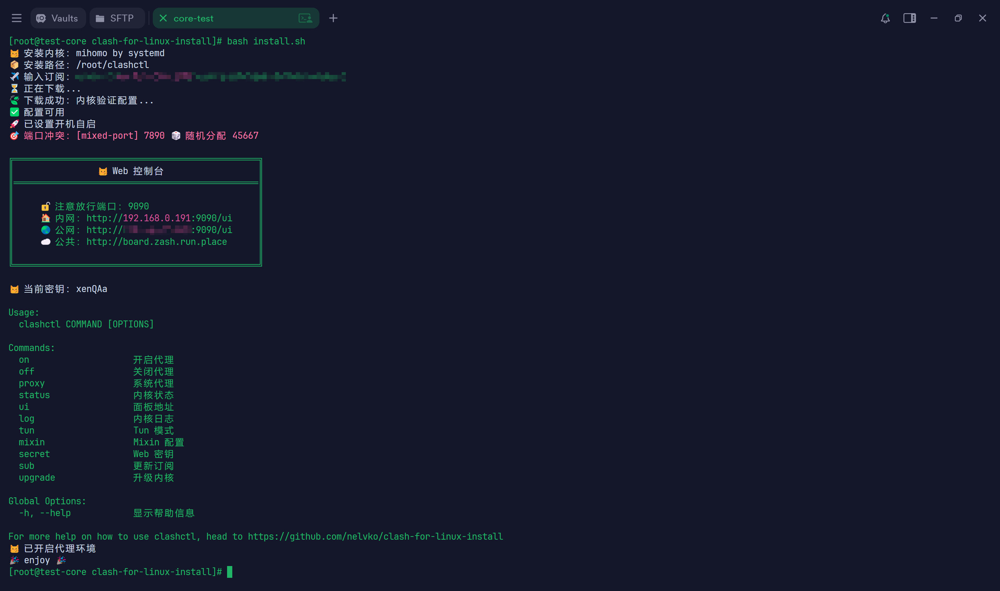

# clash-for-linux-CLI




在 Linux 终端中一键安装、管理和使用 Clash / mihomo 代理内核。支持 systemd、SysVinit、OpenRC、runit 等主流 init 系统，兼容 root 与普通用户环境。

## 快速开始

```bash
# 安装（交互式）
git clone --depth 1 https://gh-proxy.org/https://github.com/Nova42x/clash-for-linux-CLI.git \
  && cd clash-for-linux-CLI \
  && bash install.sh
```

安装完成后，`clashctl` 命令和快捷别名即可使用。

```bash
# 启动代理
$ clashon
😼 已开启代理环境

# 关闭代理
$ clashoff
😼 已关闭代理环境

# 查看状态
$ clashstatus
```

> 上述命令使用了[加速前缀](https://gh-proxy.org/)，如失效可更换其他[可用链接](https://ghproxy.link/)。

## CLI 交互式使用

### 启动与关闭

```bash
$ clashon
😼 已开启代理环境

$ clashoff
😼 已关闭代理环境
```

`clashon` / `clashoff` 会在启停内核的同时，同步设置系统代理。也可以用 `clashproxy` 单独控制系统代理：

```bash
$ clashproxy on
😼 系统代理已开启

$ clashproxy off
😼 系统代理已关闭
```

### 查看内核状态

```bash
$ clashstatus
😼 内核运行正常，端口：7890
```

### Web 控制台

```bash
$ clashui
╔═══════════════════════════════════════════════╗
║                😼 Web 控制台                  ║
║═══════════════════════════════════════════════║
║                                               ║
║     🔓 注意放行端口：9090                      ║
║     🏠 内网：http://192.168.0.1:9090/ui       ║
║     🌏 公网：http://8.8.8.8:9090/ui          ║
║     ☁️ 公共：http://board.zash.run.place      ║
║                                               ║
╚═══════════════════════════════════════════════╝

# 查看密钥
$ clashsecret
😼 当前密钥：mysecret

# 更换密钥
$ clashsecret newsecret
😼 密钥更新成功，已重启生效
```

可通过浏览器打开 Web 控制台进行可视化操作，例如切换节点、查看日志等。默认使用 [zashboard](https://github.com/Zephyruso/zashboard) 作为前端。

### 管理订阅

```bash
# 添加订阅
$ clashsub add "https://example.com/sub"
😼 订阅添加成功

# 查看所有订阅
$ clashsub ls
ID  NAME          URL
0   my-sub        https://example.com/sub

# 使用指定订阅
$ clashsub use 0
😼 已切换到订阅 0

# 更新订阅
$ clashsub update
😼 订阅更新成功

# 删除订阅
$ clashsub del 0
😼 订阅已删除
```

- 支持本地订阅：`file:///root/clashctl/resources/config.yaml`
- 链接含特殊字符时请用引号包裹

### Tun 模式

```bash
# 查看 Tun 状态
$ clashtun
😾 Tun 状态：关闭

# 开启 Tun 模式
$ clashtun on
😼 Tun 模式已开启

# 关闭 Tun 模式
$ clashtun off
😼 Tun 模式已关闭
```

Tun 模式可将本机及 Docker 容器的所有流量路由到 Clash 代理，并实现 DNS 劫持。

### Mixin 配置

```bash
# 查看 Mixin 配置
$ clashmixin

# 编辑 Mixin 配置
$ clashmixin -e

# 查看原始订阅配置
$ clashmixin -c

# 查看运行时配置
$ clashmixin -r
```

Mixin 自定义内容会与原始订阅深度合并，具有最高优先级。

### 升级内核

```bash
$ clashupgrade
😼 请求内核升级...
{"status":"ok"}
😼 内核升级成功
```

建议通过 `clashmixin` 为 GitHub 配置代理规则，避免网络问题导致升级失败。

## 命令速查

```bash
clashctl COMMAND [OPTIONS]

Commands:
    on                    开启代理
    off                   关闭代理
    status                内核状况
    proxy                 系统代理
    ui                    Web 面板
    secret                Web 密钥
    sub                   订阅管理
    upgrade               升级内核
    tun                   Tun 模式
    mixin                 Mixin 配置

Global Options:
    -h, --help            显示帮助信息
```

> `clashon` 同 `clashctl on`，`Tab` 补全更方便！

## 卸载

```bash
bash uninstall.sh
```

## 常见问题

👉 [Wiki · FAQ](https://github.com/Nova42x/clash-for-linux-CLI/wiki/FAQ)

## 引用

- [clash](https://clash.wiki/)
- [mihomo](https://github.com/MetaCubeX/mihomo)
- [subconverter](https://github.com/tindy2013/subconverter)
- [yq](https://github.com/mikefarah/yq)
- [zashboard](https://github.com/Zephyruso/zashboard)

## Star History

<a href="https://www.star-history.com/#Nova42x/clash-for-linux-CLI&Date">

 <picture>
   <source media="(prefers-color-scheme: dark)" srcset="https://api.star-history.com/svg?repos=Nova42x/clash-for-linux-CLI&type=Date&theme=dark" />
   <source media="(prefers-color-scheme: light)" srcset="https://api.star-history.com/svg?repos=Nova42x/clash-for-linux-CLI&type=Date" />
   
 </picture>
</a>

## Thanks

[@鑫哥](https://github.com/TrackRay)

## 特别声明

1. 编写本项目主要目的为学习和研究 `Shell` 编程，不得将本项目中任何内容用于违反国家/地区/组织等的法律法规或相关规定的其他用途。
2. 本项目保留随时对免责声明进行补充或更改的权利，直接或间接使用本项目内容的个人或组织，视为接受本项目的特别声明。
